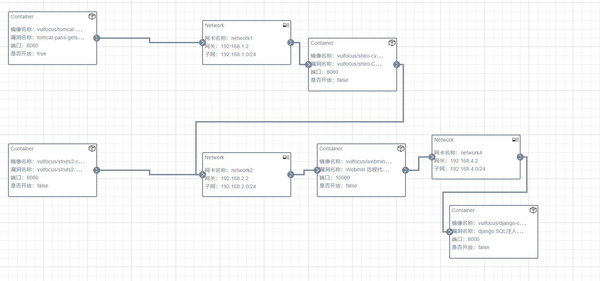

# 网安攻防实验

## 实验目标完成

- [x] 自定义靶场搭建
- [x] 内部子网数量>=2 数量为3
- [x] 攻击链路上的靶标更换数量>=2 数量为5
- [x] 攻击链路验证通过（攻击者不能直接在靶机上进行攻击，需要使用独立 IP）
- [x] 攻击链路上的靶标漏洞利用检测已完成
- [x] 入口靶标的漏洞缓解已完成（可以阻止部分攻击负载，但又允许一部分攻击负载利用成功）
- [x] 入口靶标的漏洞修复已完成（正常功能不受影响，漏洞攻击无法得手）
- [x] 使用 ATT&CK Navigator 可视化本次靶场设计中所有考察点

## 实验场景



## 网络拓扑

```sh
攻击机:192.168.249.8
搭建场景靶机：192.168.249.5，192.168.1.3(tomcat)
shiro靶机:192.168.1.1
```

## 小组分工

| 姓名   | 角色       | 主要任务             | 截止日期   |
|--------|------------|----------------------|------------|
| 张三   | 项目经理   | 统筹项目进度与协调   | 2025-06-10 |
| 李四   | 前端开发   | 负责界面设计与实现   | 2025-06-12 |
| 王五   | 后端开发   | 搭建服务器与接口开发 | 2025-06-15 |
| 赵六   | 测试工程师 | 编写测试用例与测试   | 2025-06-18 |

## 攻击可视化

## 端口映射