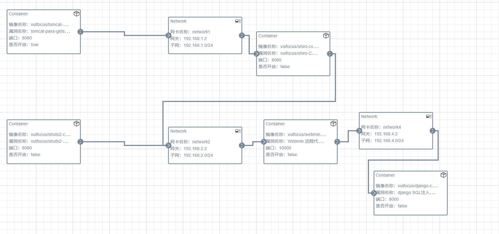

# 网安攻防实验

## 实验目标完成

- [x] 自定义靶场搭建
- [x] 内部子网数量>=2 数量为3
- [x] 攻击链路上的靶标更换数量>=2 数量为5
- [x] 攻击链路验证通过（攻击者不能直接在靶机上进行攻击，需要使用独立 IP）
- [x] 攻击链路上的靶标漏洞利用检测已完成
- [x] 入口靶标的漏洞缓解已完成（可以阻止部分攻击负载，但又允许一部分攻击负载利用成功）
- [x] 入口靶标的漏洞修复已完成（正常功能不受影响，漏洞攻击无法得手）
- [x] 使用 ATT&CK Navigator 可视化本次靶场设计中所有考察点

## 实验场景



## 网络拓扑

```yaml
攻击机（Kali）
192.168.249.8
     │
     ▼
搭建场景主机（Tomcat，双网卡）
eth0: 192.168.249.5
eth1: 192.168.1.2（网关）
     │
     ▼
┌────────────────────────────┐
│     子网 192.168.1.0/24      │
│ 网关：192.168.1.2             │
│                              │
│ ┌────────────────────────┐  │
│ │       shiro 靶机         │  │
│ │ eth0: 192.168.1.1        │  │
│ │ eth1: 192.168.2.1        │  │
│ └────────────────────────┘  │
└────────────────────────────┘
               │
               ▼
┌────────────────────────────┐
│     子网 192.168.2.0/24      │
│ 网关：192.168.2.2             │
│                              │
│ ┌────────────────────────┐  │
│ │     struts2 靶机         │  │
│ │     192.168.2.3          │  │
│ └────────────────────────┘  │
│ ┌──────────────────────────────┐
│ │        webmin 靶机            │
│ │ eth0: 192.168.2.4             │
│ │ eth1: 192.168.4.3             │
│ └──────────────────────────────┘
└────────────────────────────┘
               │
               ▼
┌────────────────────────────────────┐
│       子网 192.168.4.0/24           │
│ 网关：192.168.4.2     │
│                                    │
│ ┌──────────────────────────────┐  │
│ │         django 靶机           │  │
│ │         192.168.4.1           │  │
│ └──────────────────────────────┘  │
└────────────────────────────────────┘

```

## 小组分工

| 姓名   | 角色       | 主要任务             | 截止日期   |
|--------|------------|----------------------|------------|
| 邹全才   | 红队   | 场景搭建、tomcat、shiro靶机，一二层内网穿透   | 2025-06-8 |
| 刘天佑   | 红队   | webmin、struts2、django靶机、二三层内网穿透   | 2025-06-8 |
| 罗轩   | 蓝队   | 搭建服务器与接口开发 | 2025-06-8  |
| 程启  | 蓝队 | 编写测试用例与测试   | 2025-06-8  |
| 罗轩   | 蓝队   | 搭建服务器与接口开发 | 2025-06-8  |
| 程启  |蓝队 | 编写测试用例与测试   | 2025-06-8  |


## 攻击可视化

## 端口转发
