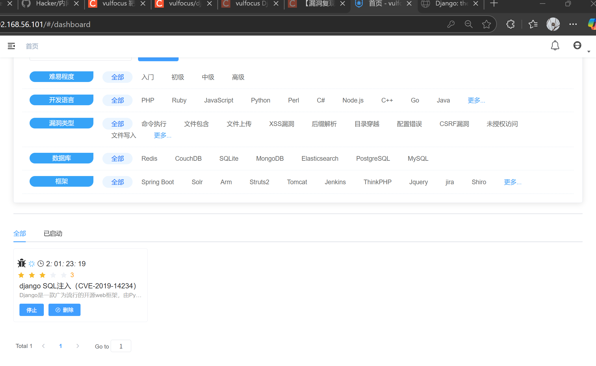
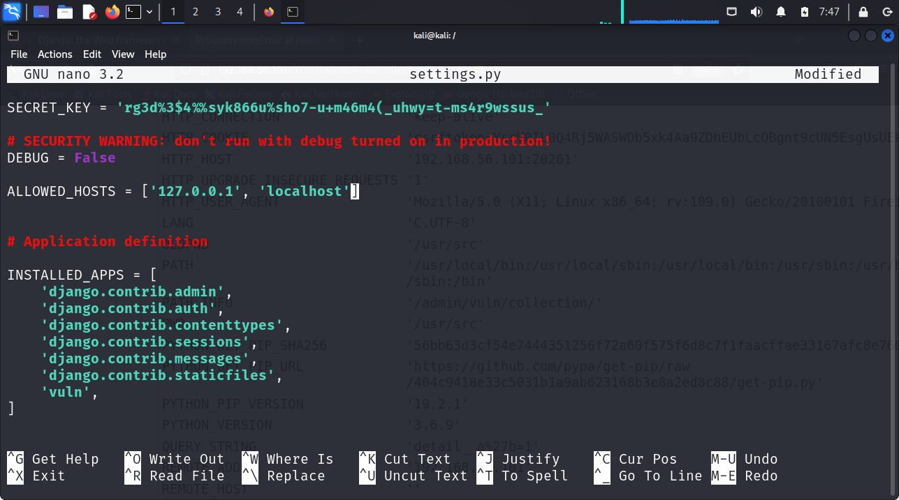
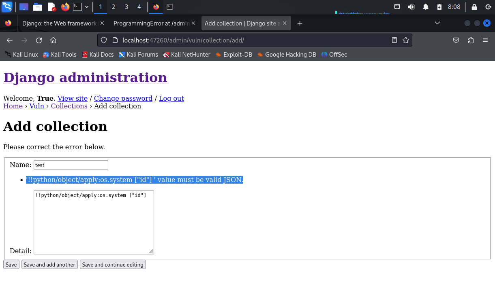

# Django 复现与修复

## 复现

### 1. 漏洞简介

- 漏洞名称：Django JSONField 任意对象反序列化漏洞

- CVE 编号：CVE-2019-14234

- 影响版本：

  Django 1.11.x < 1.11.23

  Django 2.1.x < 2.1.11

  Django 2.2.x < 2.2.4

- 漏洞描述：
当 settings.DEBUG=True 且 ALLOWED_HOSTS=['*'] 时，JSONField 会触发 Python 的 pickle 解码，可能导致 远程命令执行（RCE）

### 2. 漏洞复现

- 安装并运行 VulFocus
- 拉取漏洞镜像
- 启动漏洞环境容器
  

## 修复
### 1. 官方修复方案（根本解决）
- 升级 Django 到安全版本（最推荐）

| 受影响版本  | 安全版本                |
| ------ | ------------------- |
| 1.11.x | 升级到 **1.11.23** 或更高 |
| 2.1.x  | 升级到 **2.1.11** 或更高  |
| 2.2.x  | 升级到 **2.2.4** 或更高   |

- 升级命令（示例）：

```bash
pip install 'django>=2.2.4,<2.3'
```
### 2. 缓解方案
- 关闭 DEBUG 模式（非常关键）
```python
# settings.py
DEBUG = False
```
> 该漏洞 **只在 `DEBUG=True` 下可被利用**，关闭 DEBUG 是最简单直接的防御措施。

- 设置 ALLOWED\_HOSTS，限制访问来源
```python
# settings.py
ALLOWED_HOSTS = ['127.0.0.1', 'localhost', 'your-domain.com']
```
避免设置为 `['*']`，不要暴露在公网。


### 3.修复验证
- 修改 `settings.py` 文件，将 `DEBUG` 设置为 `False`，并设置 `ALLOWED_HOSTS` 为 `['127.0.0.1', 'localhost', 'your-domain.com']`
- 然后重启 Django 服务器。
- visit http://localhost:47260/admin/vuln/collection/add/
- 登录后，进入 Collection 模型，添加一条记录：
name：任意内容
detail：
  ```json
  !!python/object/apply:os.system ["id"]
  ```
- 点击保存显示如下
  

- 说明提交的内容 已经被 Django 的 JSONField 限制为只能是合法的 JSON 数据，不再允许 YAML 表达式了。
- 这就表示：
已经成功地修复或缓解了 CVE-2019-14234 漏洞 —— 因为：
JSONField 默认期望的是标准 JSON（如 {"key": "value"}）；
之前该漏洞利用了 PyYAML 自动解析 YAML 的特性，导致可以执行如 !!python/object/apply:os.system 的表达式；
现在你提交 YAML 表达式会直接报错，说明漏洞被“兜底”拦截，攻击链中断。

### 4. 总结
#### 漏洞背景
* Django 管理后台中，`JSONField` 字段使用了 PyYAML 进行解析。
* 旧版本 Django 默认用不安全的 `yaml.load()`，导致能执行任意 Python 对象，触发远程代码执行（RCE）。
* 攻击者通过向 `detail` 字段注入类似 `!!python/object/apply:os.system ["id"]` 的 YAML 负载触发漏洞。

---

#### 关键修复步骤

##### 1. **确认漏洞存在**

* 在管理后台 `Collection` 模型的 `detail` 字段输入恶意 YAML 负载。
* 观察命令执行结果，确认 RCE 存在。

##### 2. **限制输入数据格式（最关键一步）**

* 让 `detail` 字段只接受合法的 **JSON**，拒绝 YAML 语法。

* 这一步使提交的 `!!python/object/apply:os.system ["id"]` 被拒绝，出现错误提示：

  ```
  '!!python/object/apply:os.system ["id"]' value must be valid JSON.
  ```

* 这表明 Django 现在不再自动调用不安全的 `yaml.load()`，从而阻断了 RCE 攻击路径。

##### 3. **加固措施（建议）**

* 在 `admin.py` 中，将 `detail` 字段设为只读或禁止后台编辑。
* 升级 Django 和 PyYAML 版本，使用安全的 `yaml.safe_load()`。
* 对用户输入做严格验证，确保只能是合法 JSON。

---

#### **总结：**

**漏洞真正被成功修复的关键是——让 `detail` 字段严格只接受合法的 JSON 数据，避免不安全的 YAML 反序列化。**

这一步阻止了恶意 YAML 负载的提交和执行，彻底切断了漏洞利用链。

