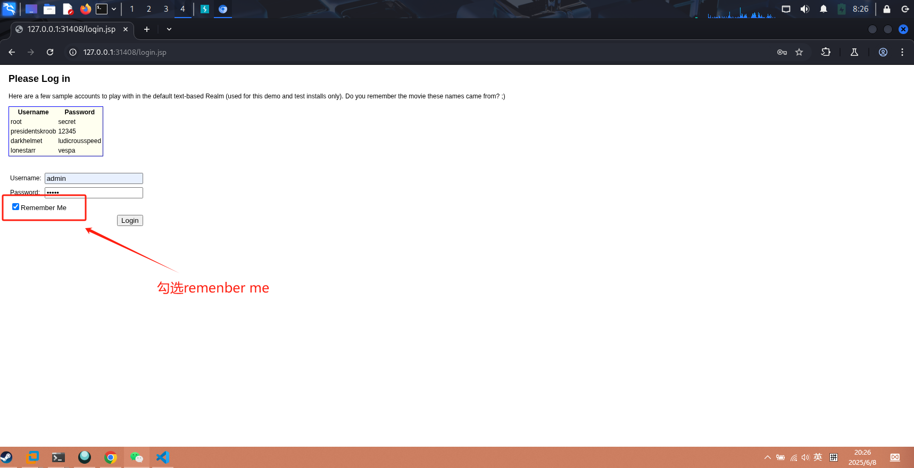
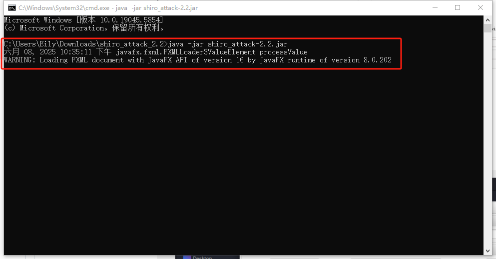
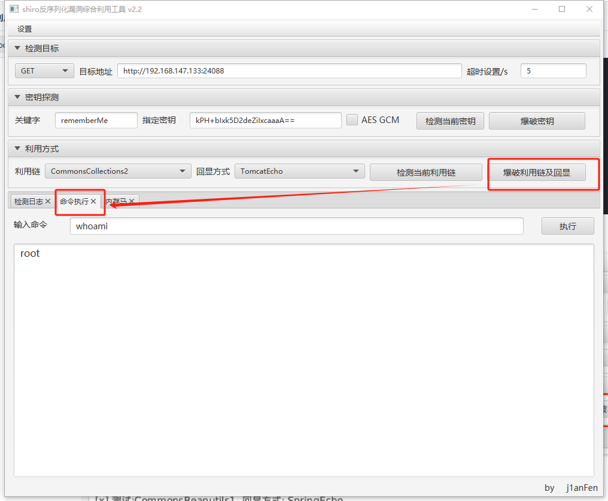
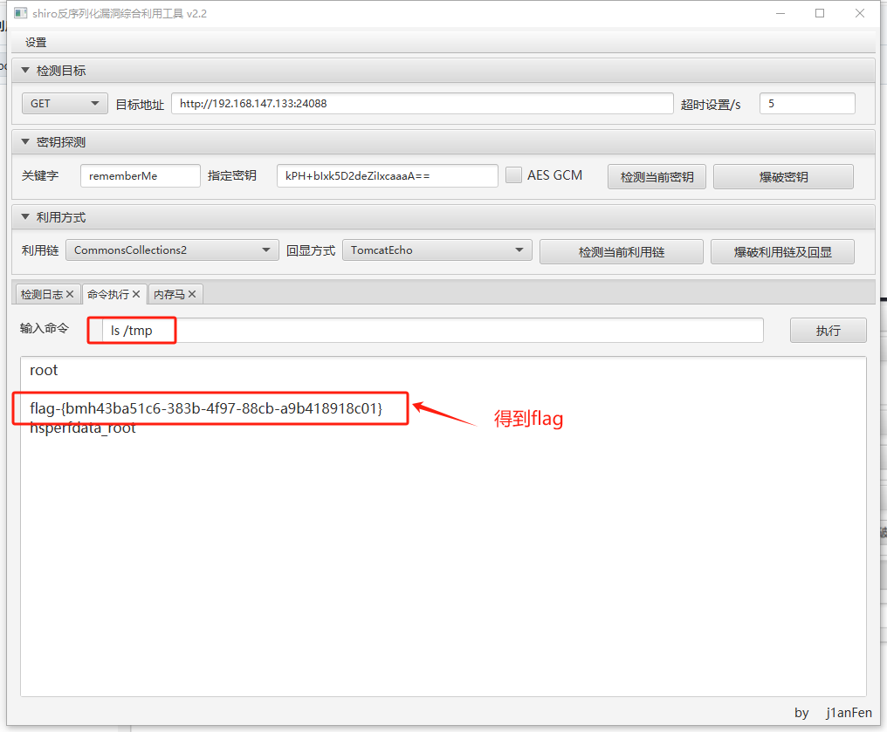
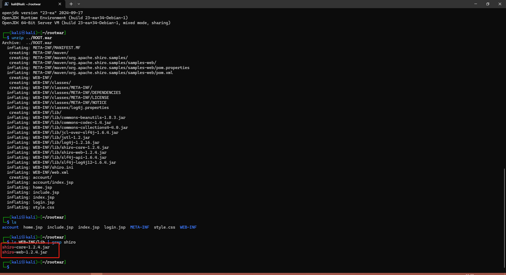
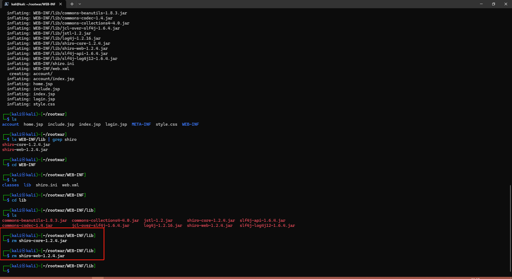
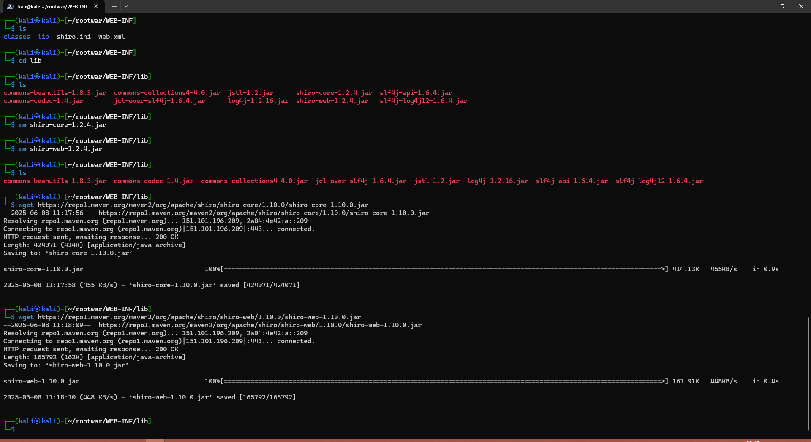
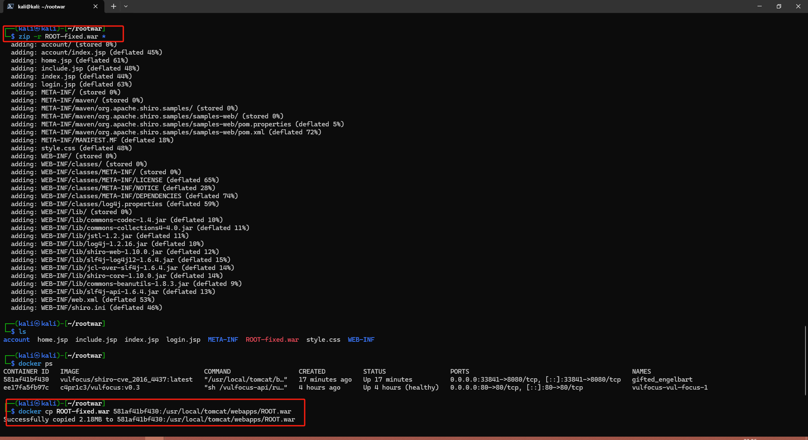
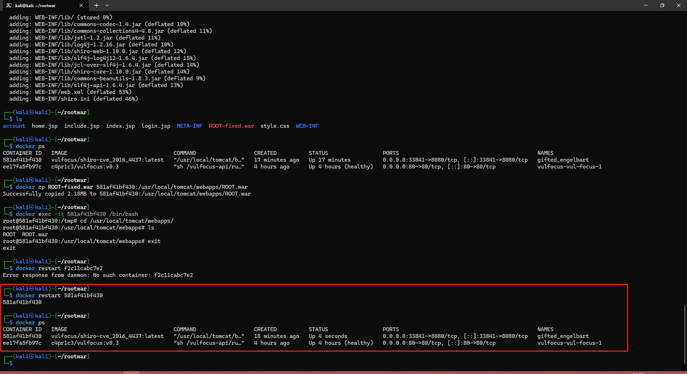
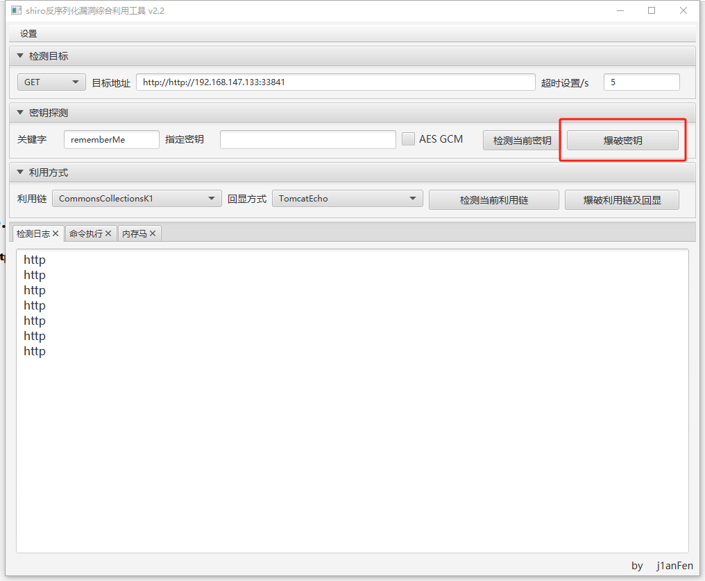

# Shiro-CVE-2016-4437 漏洞缓解与修复

Apache Shiro 是一个强大且灵活的 Java 安全框架，主要用于身份认证、授权、加密和会话管理。**CVE-2016-4437** 是 Shiro 中一个高危的反序列化远程代码执行漏洞，严重影响使用默认配置的应用。

---

## 漏洞基本信息

- **漏洞编号**：CVE-2016-4437  
- **影响版本**：Apache Shiro ≤ 1.2.4  
- **漏洞类型**：Java 反序列化导致的远程代码执行（RCE）  
- **漏洞等级**：高危  
- **利用条件**：Shiro 使用默认的 `rememberMe` 机制，攻击者可控制请求中的 `Cookie` 
- **修复版本**：1.2.5+

---

## 漏洞原理

`Apache Shiro` 使用 `rememberMe` 功能时，会在客户端设置一个名为 `rememberMe` 的 Cookie，其值为序列化并加密后的 Java 对象。默认使用固定的 `AES` 密钥（`kPH+bIxk5D2deZiIxcaaaA==`）进行加密，攻击者可以构造恶意序列化对象并利用默认密钥完成反序列化注入，实现远程代码执行。

---

## 漏洞验证与利用

### 1. 验证是否使用 Shiro 框架

- 使用浏览器访问目标系统：

  

- 使用 `Burp Suite` 抓包，勾选“Remember me”，输入任意用户名密码并登录：

    
  

  若响应头中存在 `rememberMe=deleteMe`，说明系统使用了 Shiro。

---

### 2. 使用漏洞利用工具

1. 下载利用工具：[https://github.com/j1anFen/shiro_attack](https://github.com/j1anFen/shiro_attack)  
2. 运行：

   ```bash
   java -jar shiro_attack-2.2.jar
   ```

   

3. 点击“爆破密钥”，发现 Shiro 框架存在漏洞：

   

4. 使用命令执行功能输入 `whoami`，成功回显当前用户为 `root`，说明已获得代码执行权限：

   

5. 查看 `flag`：

   

---

## 漏洞缓解与修复

### 1. 查看部署路径

进入容器 `/usr/local/tomcat/webapps/` 目录，发现：

```bash
ROOT  ROOT.war
```


说明 `Web` 应用是默认部署的 `ROOT` 应用。

---

### 2. 检查 Shiro 版本

- 解压 `ROOT.war`：

  容器中无 `jar` 命令，因此将 `.war` 文件复制至宿主机进行解包：

    
  

- 查看使用的 `Shiro` 版本，发现为 `1.2.4`（存在漏洞）。

---

### 3. 删除旧版本依赖

删除 `WEB-INF/lib/` 目录下的 `shiro-core-1.2.4.jar` 和 `shiro-web-1.2.4.jar`：



---

### 4. 下载新版本 Shiro

从 [Maven 官网](https://mvnrepository.com/artifact/org.apache.shiro/shiro-core) 下载 `shiro-core-1.10.0.jar` 和 `shiro-web-1.10.0.jar`：



---

### 5. 重新打包 WAR 文件并传回容器

```bash
zip -r ROOT-fixed.war *
```



使用 `docker cp` 命令将新的 `.war` 文件复制回容器并替换原始应用。

---

### 6. 重启容器

```bash
docker restart <容器ID或名称>
```



---

## 验证修复效果

重新运行漏洞利用工具，点击“爆破密钥”时未检测到可利用的 `Shiro` 框架，说明漏洞修复成功：



---

## 总结

通过以下步骤可以有效缓解和修复 Apache Shiro CVE-2016-4437 漏洞：

- 升级 Shiro 至 1.2.5 或更高版本（建议使用 1.10.0）
- 替换默认 `rememberMe` 加密密钥
- 不信任任何客户端数据，禁用不必要的序列化功能

建议在生产环境中定期审计第三方依赖库，并配合安全工具对反序列化入口进行拦截或检测。
