## 对vulfocus/tomcat-pass-getshell:latest漏洞进行修复的蓝队部分

### 漏洞介绍：


Apache Tomcat 是一个开源的 Java Servlet 容器，广泛用于部署 Java Web 应用程序。WAR 文件是用于分发 Web 应用程序的压缩文件格式。通过不安全的文件上传机制，攻击者能够：
```
上传恶意的 WAR 文件。
通过该文件在服务器上执行任意代码。
可能导致数据泄露、服务器控制和其他安全问题。
```


### 首先根据红队部分同学的攻击报告进行对漏洞的攻击：

首先根据场景地址进入网页，点击红框的**manager app**即可输入用户名和密码进行登录验证：

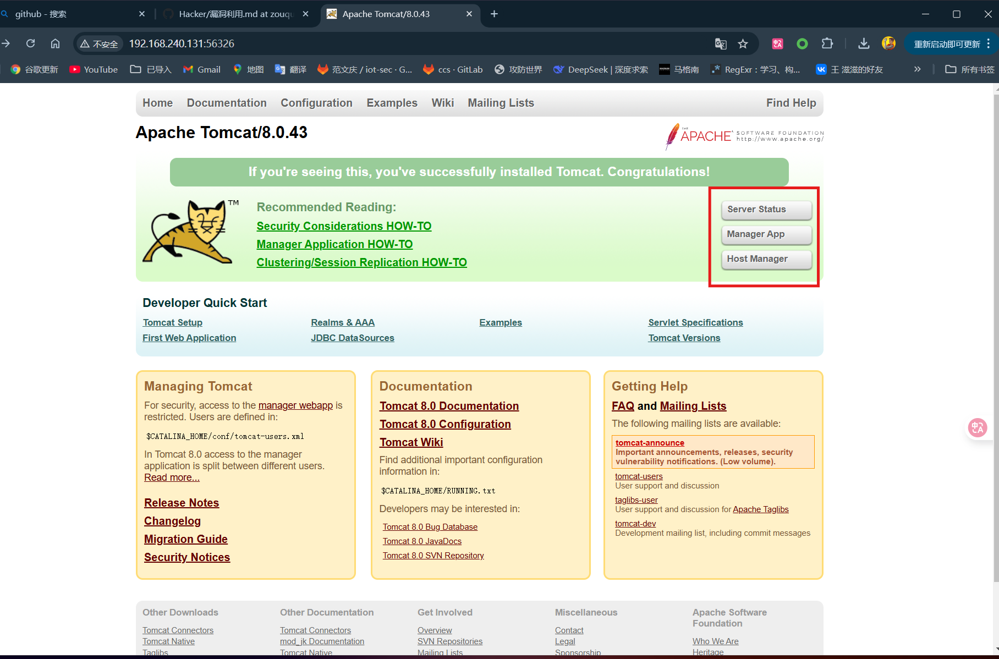

开启burpsuite，把谷歌浏览器proxy switchyomega插件的代理模式换成burpsuite

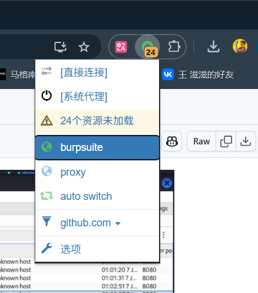

我的burp直接自动解码，根据这个格式进行爆破

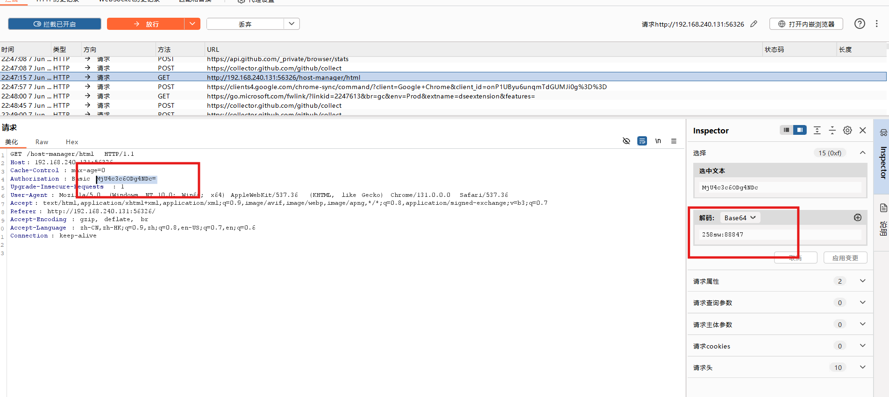

爆破得知密码为：tomcat:tomcat

蚁剑连接：

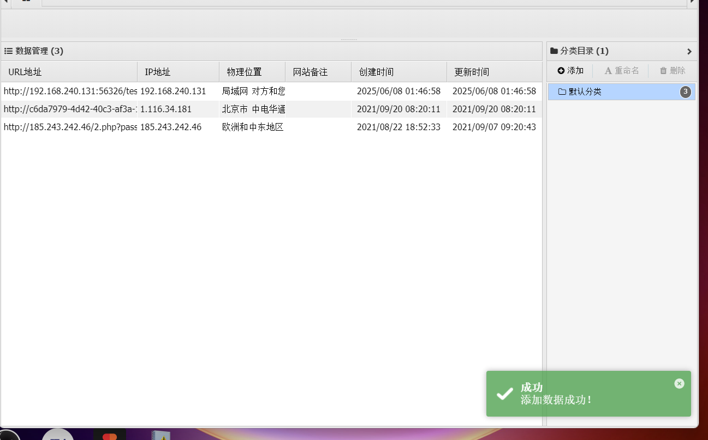

尝试冰蝎连接：

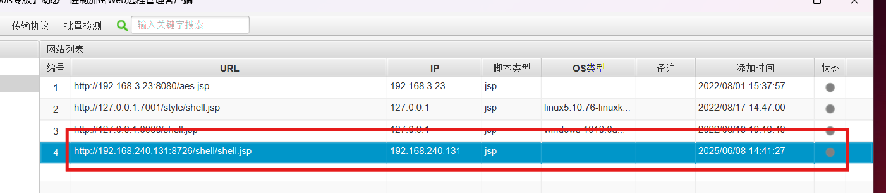


最后还是在msfconsole上配置(multi/http/tomcat_mgr_upload)模块：

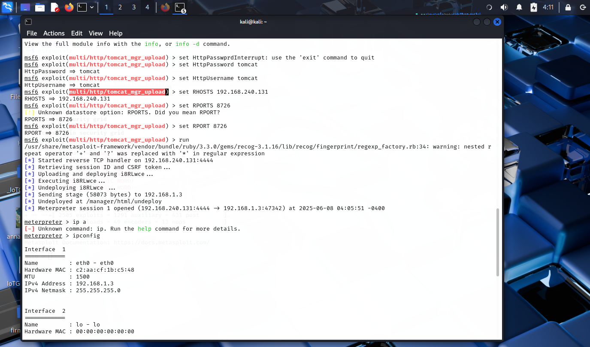

成功拿到flag:

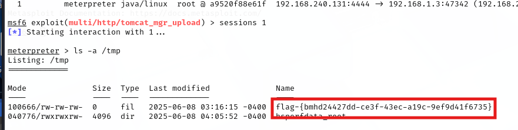


### 在成功渗透到 Tomcat 服务器中后，修复文件上传漏洞的方法需要确保系统的安全性。以下是两个简单易实现的修复方法:

#### 方法一：限制和验证文件上传

**步骤：**

1. **限制上传文件的类型**：
   - 修改 Tomcat 的 web.xml 配置文件，确保只允许特定的文件类型（如 .jpg、.png、.txt 等），并拒绝可执行文件（如 .war、.jsp、.php 等）。

   ```xml
   <servlet>
       <servlet-name>fileUploadServlet</servlet-name>
       <servlet-class>com.example.FileUploadServlet</servlet-class>
       <init-param>
           <param-name>allowedTypes</param-name>
           <param-value>image/jpeg,image/png,text/plain</param-value>
       </init-param>
   </servlet>

   ```

2. **文件大小限制**：
   - 在文件上传的处理逻辑中添加文件大小限制，确保上传的文件不超过设定的大小。

   ```java
   if (file.getSize() > MAX_FILE_SIZE) {
       throw new ServletException("File size exceeds limit!");
   }
   ```

3. **使用安全的上传路径**：
   - 确保上传文件的路径不在可执行目录中，避免上传的文件被执行。

4. **重命名上传文件**：
   - 在后台处理文件上传时，使用随机字符串重命名上传的文件，以防止直接访问或猜测文件名。

### 方法二：实施强身份验证和访问控制

**步骤：**

1. **启用基本认证**：
   - 在 `conf/tomcat-users.xml` 中定义用户角色，并将管理接口（如 Manager 和 Host Manager）配置为仅允许特定用户访问。

   ```xml
   <tomcat-users>
       <role rolename="manager-gui"/>
       <role rolename="manager-script"/>
       <user username="admin" password="strong-password" roles="manager-gui,manager-script"/>
   </tomcat-users>
   ```

2. **IP 白名单**：
   - 对于管理界面的访问，限制可访问的 IP 地址。可以在 `server.xml` 中配置连接器，以允许特定 IP 地址访问管理功能。

   ```xml
   <Context>
       <Valve className="org.apache.catalina.valves.RemoteAddrValve"
              allow="127\.\d{1,3}\.\d{1,3}\.\d{1,3}|192\.168\.1\.\d{1,3}"/>
   </Context>
   ```

3. **启用 HTTPS**：
   - 配置 Tomcat 使用 HTTPS，通过 SSL/TLS 加密传输数据，防止凭据和敏感数据在网络中被窃听。

   ```xml
   <Connector port="8443" protocol="org.apache.coyote.http11.Http11NioProtocol"
              maxThreads="150" SSLEnabled="true" 
              scheme="https" secure="true" 
              clientAuth="false" 
              sslProtocol="TLS" />
   ```

下面是缓解实验截图说明：
首先找到关键文件的所在地：

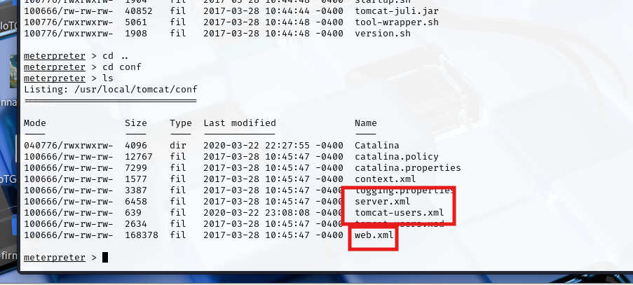

然后下载到本地进行编辑：

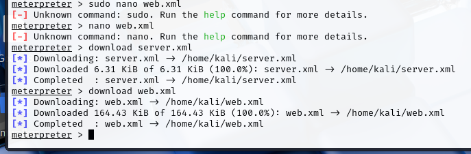


然后在文件处打开终端，用nano编辑器编辑，保存并重新上传：

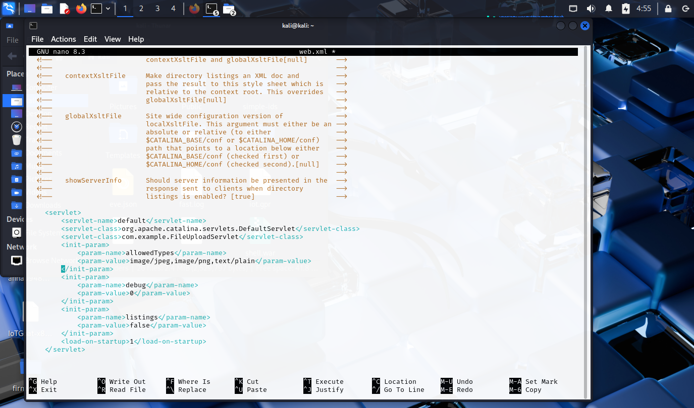

将上面那一行删除，下面哪一行保留，就会更换用户名和密码：
username="2437fcnb" password="8fu3i39fosuwj"

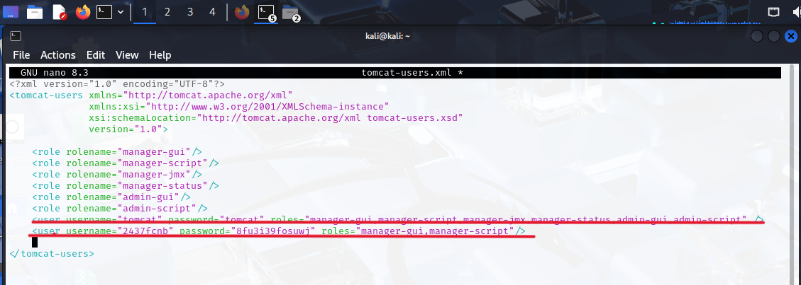

### 方法三：升级版本使用

在Tomcat HomeApache Tomcat®官网上找到新一些的版本，对应下载到机器上，：

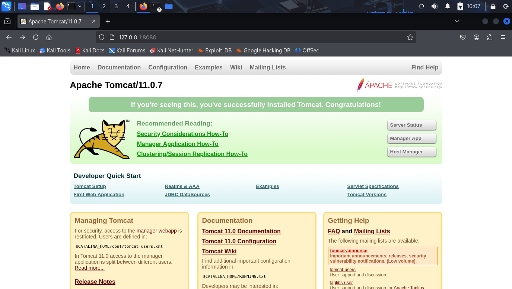

点击tomcat所在文件夹即可查看关键文件，对应有相应的修改补漏：

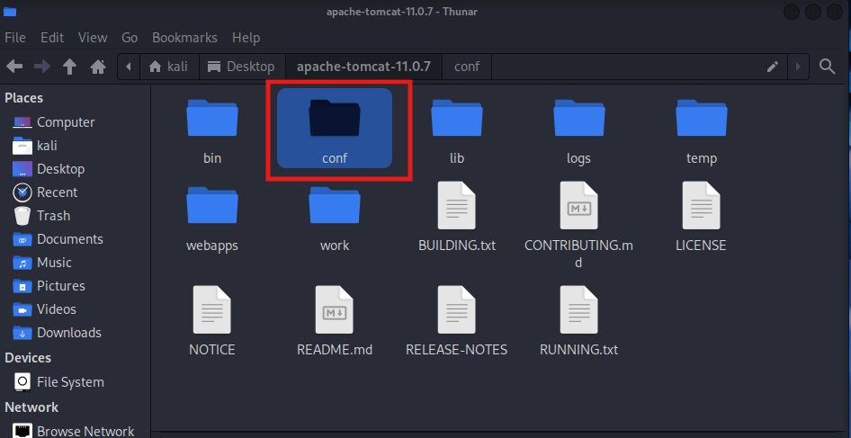

配置好conf/tomcat-users.xml文件包括用户名和密码后，通过8080端口登录进去，这次在上传test.war，进去test.jsp下发现不是空白，而是防护报错：

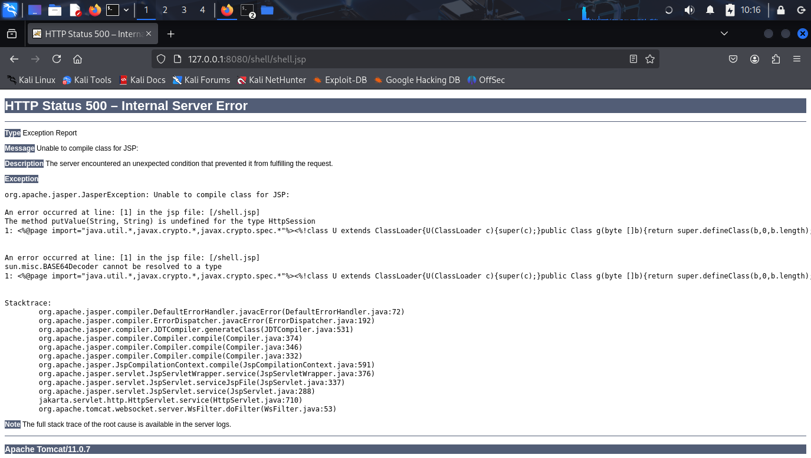

证明漏洞防护成功。
### 总结

以上3个方法提供了文件上传验证和身份验证控制的基础设施以及整体优化来加强 Tomcat 的安全性。实施这些修复措施后，系统的安全性将得到显著提升，能够有效减少通过文件上传漏洞进行攻击的风险。
